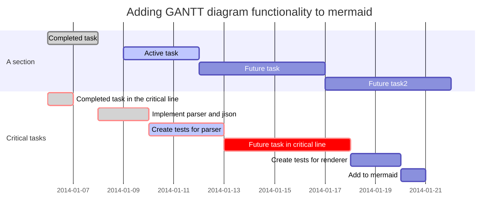
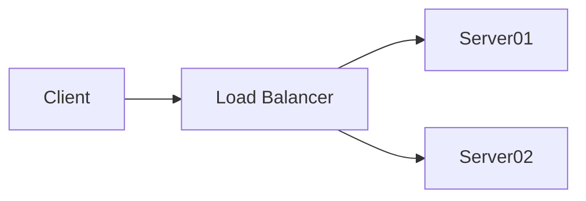

# Chapter
## Section (referable) {#sec:test}
### Subsection
#### Subsubsection

This is normal text.

```python
while (true):
    print('this is code')
    
```

Inline Code is done like this `print('Hallo Welt')`{.python}. Neat!
    
    
    
<!-- This is a comment -->

: This is a table caption

| Table Header 1 | Table Header 2 | Table Header 3 |
|----------------|----------------|----------------|
|                |                |                |
|                |                |                |
And this is an image. The caption is inside the square brackets.

{#fig:bild1 width=200px}

A reference to the image: @fig:bild1

A reference to a Chapter: @sec:test

Some maths:
$$
\begin{aligned}
y = y(x,t) &= A e^{i\theta} \\
&= A (\cos \theta + i \sin \theta) \\
&= A (\cos(kx - \omega t) + i \sin(kx - \omega t)) \\
\end{aligned} 
$$
{#eq:foo}

Inline Maths are done like this $\lim_{h \rightarrow 0 } \frac{f(x+h)-f(x)}{h}$. Neat!

Some reference to maths @eq:foo.

This is a reference to one of your sources: [@exsource]

1. A numbered list
2. with two items

* a bulleted list
* with
* four
* items

And a footnote[^1]

[^1]: This is the footnote text

> This is a quote [@exsource]
> Or a whole block

And this is an acronym \ac{PMS}.

The long version will only be placed the first time you use it: \ac{PMS}.

You can also use [mermaid.js](https://mermaid-js.github.io/mermaid/) diagram rendering via fenced code blocks.
To make this work with exporting run `npm install -g mermaid-filter` and ensure the binary is in your `$PATH` and add `-F mermaid-filter` in your Advanced Settings pandoc command.




