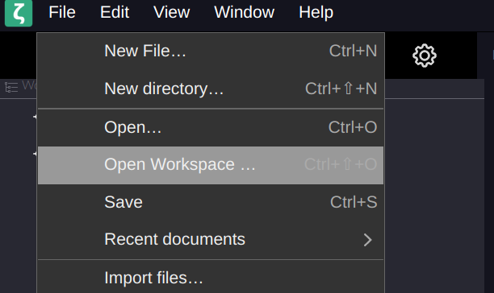
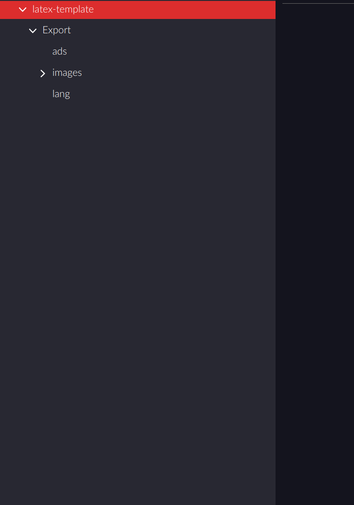
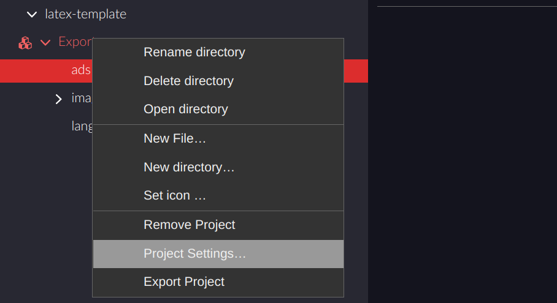
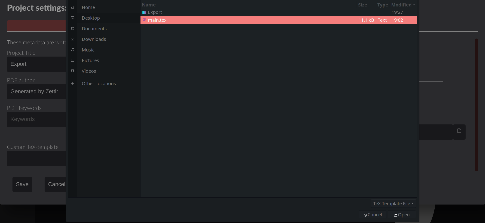
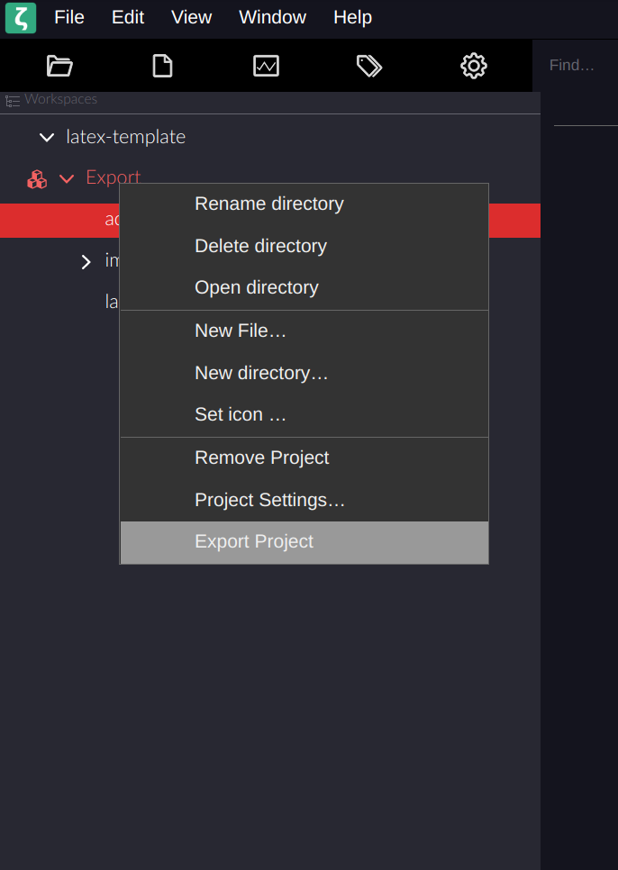

# Installation

Open a terminal in the location where you want to create your project and clone the repository

```bash
git clone https://github.com/glxplz/zettlr-template-dhbw.git
```

Open Zettlr and navigate to **File -> Open Workspace**



Select the folder you just cloned

Expand the workplace in Zettlr




Right click **Export** and go to project settings



Under **Custom TeX-Template** select the "**main.tex"** in the project's parent folder **(if you move you project folder, you will have to redo this step!)**




In Project Settings you may change other attributes of your project like title, author, margins, citation styles etc.

# Exporting a PDF

Right click the project folder and click **Export Project**



**This may take a while! If you didn't get a success or error notification it is still running!**

# Common Errors

## Export failed - The font "XYZ" cannot be found

Go to **Project settings** and under **Font** select fonts which are installed on your system. Hit **Save**. The name has to match exactly.

# Changing stuff in the template

## I want to change the language

In **ads/settings.tex** change the line 
```tex
\newcommand{\documentLanguage}{de}
```
to your desired language ("de" for German or "en" for English)
g
## I want to change the document type

In **ads/settings.tex** change the line 

```tex
\newcommand{\documentType}{T2\_3000}
```

to your desired type. Possible types are

```tex
T2\_1000
T2\_2000
T2\_3000
T2\_3100
T2\_3300
```

## I want to change something else

You can find everything you will need in the beginning of **ads/settings.tex**. The following lines can be used fo configuration and should be self explanatory:

`````tex
\newcommand{\documentPeriod}{12 Wochen}

\newcommand{\matriculationNumber}{12345678}

\newcommand{\locationUniversity}{Friedrichshafen}
\newcommand{\department}{Wirtschatsingenieurwesen - Maschinenbau}
\newcommand{\course}{TWI18-1}

\newcommand{\degree}{Bachelor of Engineering}

\newcommand{\releaseDate}{März 2021}
\newcommand{\releaseLocation}{Manching}

\newcommand{\companyName}{Airbus Defence and Space GmbH}
\newcommand{\companyLocation}{Manching}

\newcommand{\tutor}{Dr.-Ing. Peter Lustig}
`````

## I don't need a list of tables/list of figures

In **main.tex** comment the relevant lines:

`````tex
\pagebreak
\listoftables
\pagebreak
\listoffigures
`````

